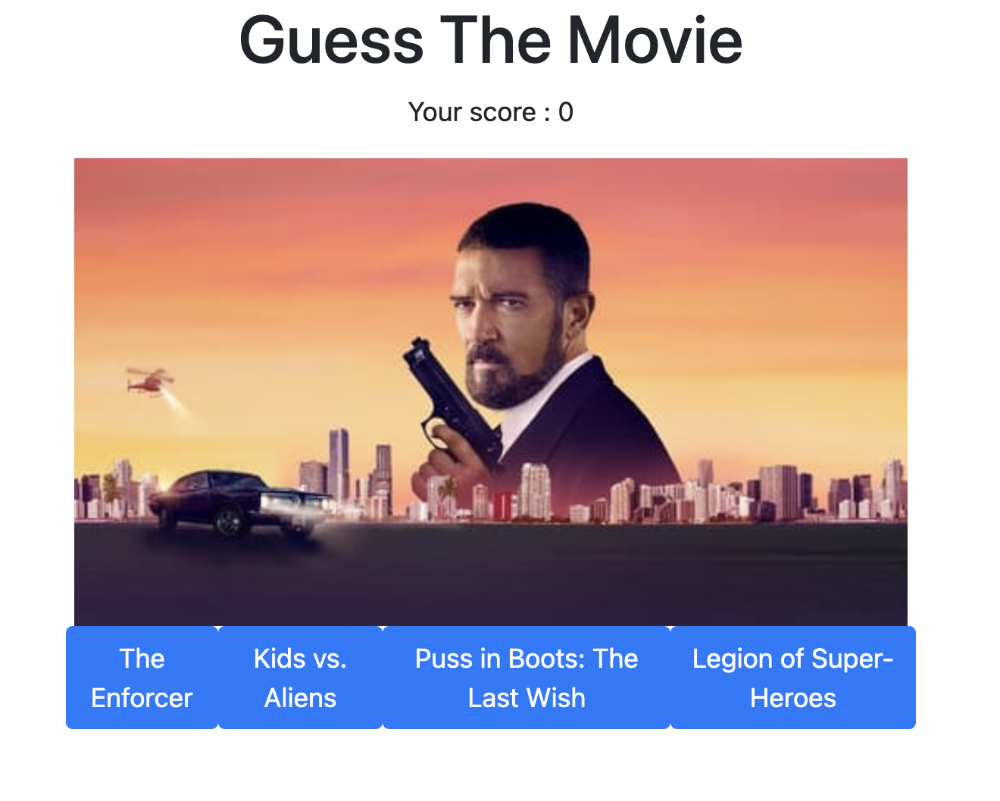
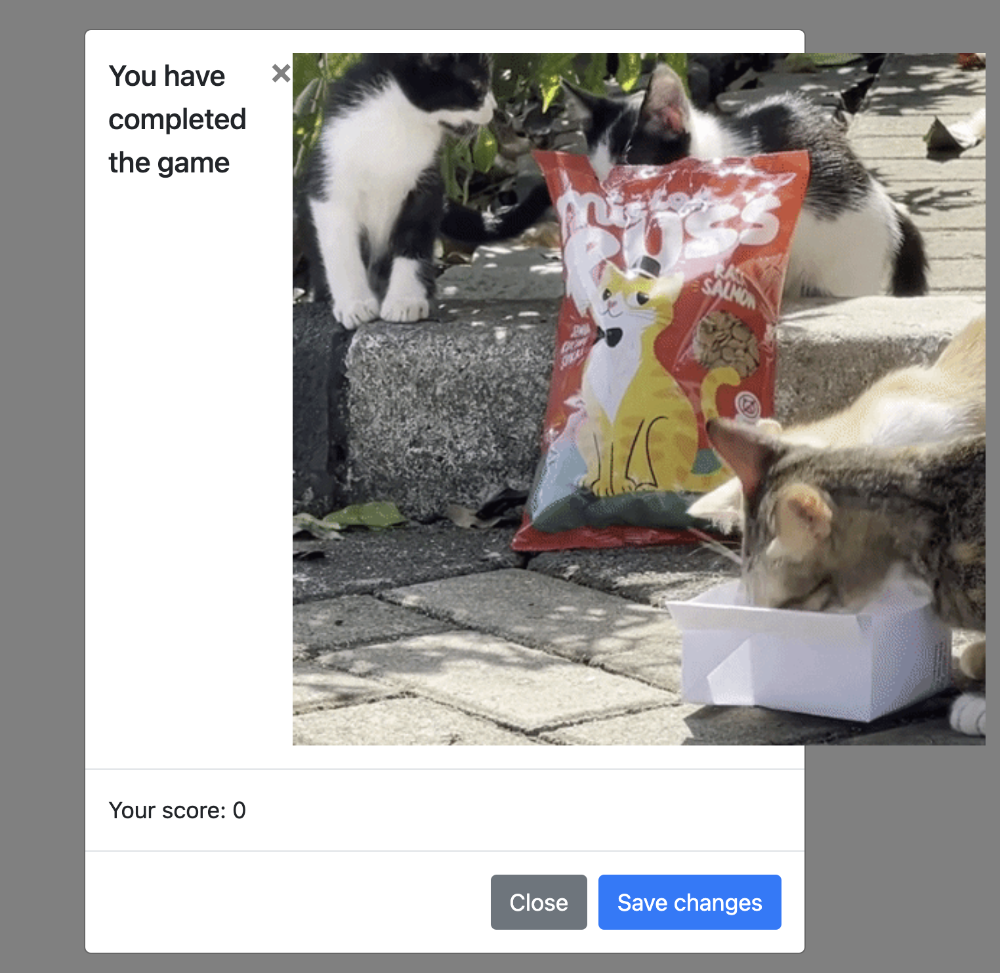

# guess-the-movie

## Description

Guess the movie based on the poster displayed. Get a point if you get the question right, after a number of turns you can save your score into the high score board (in development)

Get Cat gifs when you complete the round!

## Technologies used

Technologies used: movie API, Giphy API, jQuery, Bootstrap
Methodologies: Figma prototyping, Github Projects, Google Jamboard for ideation session

## Screenshot

## Authors

Created by Brendan Conroy-Low and Chris Smith

## Acknowledgments 

Alameen Ipaye

## Link to the deployed application

https://github.com/chriswordsmith/guess-the-movie

https://chriswordsmith.github.io/guess-the-movie/

## Link to presentation

https://docs.google.com/presentation/d/1fEO-RtPm1yaIvWBgHpKLKZX4y_7UW-YRSYDtxiL0QFE/edit#slide=id.g20e50f1be0d_0_28

